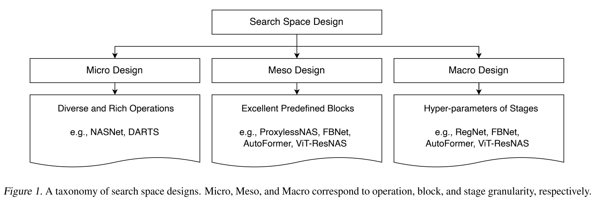
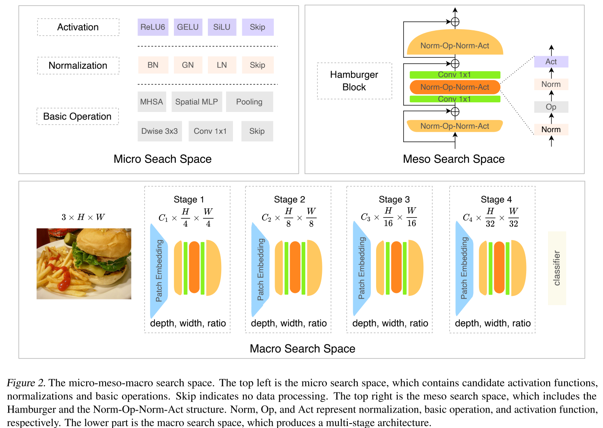

# Searching for BurgerFormer with Micro-Meso-Macro Space Design (ICML 2022)

This is an official pytorch implementation for "Searching for BurgerFormer with Micro-Meso-Macro Space Design". 



# Requirements
* PyTorch 1.8.0
* timm 0.4.12

# BurgerFormer Models

Pre-trained checkpoints are released [google drive](https://drive.google.com/drive/folders/1malgIz2qzHUjQH78Dya55TgegD4rAVSm?usp=sharing)/[baiduyun](https://pan.baidu.com/s/1sreW9PclWNHjMAzwqXfsvg). Place them in the .checkpoints/ folder.

Note: access code for `baiduyun` is `gvfl`.

# Validation
To evaluate a pre-trained BurgerFormer model on ImageNet, run:
```shell
bash script/test.sh
```

# Train
To retrain a BurgerFormer model on ImageNet, run:
```shell
bash script/train.sh
```

# TODO
- [ ] Searching Code

# Citation
Please cite our paper if you find anything helpful.
```
@InProceedings{yang2022burgerformer,
  title={Searching for BurgerFormer with Micro-Meso-Macro Space Design},
  author={Yang, Longxing and Hu, Yu and Lu, Shun and Sun, Zihao and Mei, Jilin and Han, Yinhe and Li, Xiaowei},
  booktitle={ICML},
  year={2022}
}
```

# Acknowledgment
This code is heavily based on [poolformer](https://github.com/sail-sg/poolformer), [ViT-ResNAS](https://github.com/yilunliao/vit-search), [pytorch-image-models](https://github.com/rwightman/pytorch-image-models), [mmdetection](https://github.com/open-mmlab/mmdetection). Great thanks to their contributions.